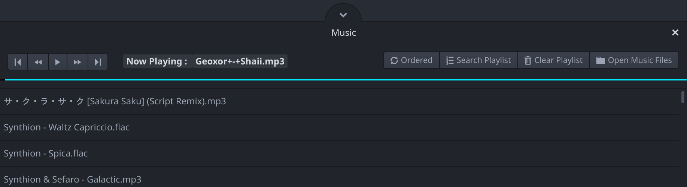

# atom-music package

This is a very simple music player plug-in for [Atom](https://atom.io).

__

Just press <kbd>Alt-M</kbd> to get it up.
Then load your audio files by using the `Open Music Files` button on the right hand side AND VOILA there you go playing your favorite music while doing your coding.

Happy Coding!

## API
 Command                        | Function                                                             | Default keystroke
:------------------------------:|----------------------------------------------------------------------|:-----------------:
 `atom-music:toggle`            | Toggles the whole music player.                                      | <kbd>Alt-M</kbd>  
 `atom-music:play-pause`        | Toggles between play and pause for the current track.                |
 `atom-music:toggle-shuffle`    | Toggles between shuffled and ordered playlist.                       |
 `atom-music:search-playlist`   | Playlist search popups up.                                           |
 ~~`atom-music:show-playlist`~~ | Same as above but **deprecated and removed.** since version `1.x.x`. |
 `atom-music:forward`           | Fast forward (*by default 15 seconds each time*).                    |
 ~~`atom-music:forward-15s`~~   | Same as above but **deprecated and removed.** since version `1.x.x`. |
 `atom-music:rewind`            | Rewind (*by default 15 seconds each time*).                          |
 ~~`atom-music:backward-15s`~~  | Same as above but **deprecated and removed.** since version `1.x.x`. |
 `atom-music:next-track`        | Skips to the next track.                                             |
 `atom-music:previous-track`    | Skips back to the previous track.                                    |

## Troubleshooting
If the keystrokes doesn't work then please use <kbd>Ctrl-.</kbd> to check your keybindings and follow these instructions: https://flight-manual.atom.io/using-atom/sections/basic-customization/#customizing-keybindings

## Project status meanings
 * **Refactoring:** Structural and technical changes have currently priority.
 * **Active:** Default status.
 * **Fixes only:** The project is maintained at the minimum level to apply at least fixes.
 * **Not maintained:** The project is not maintained any more (ready to take over).

*Feature requests are welcomed all the time, of course! ;-)*

## License
This project is free software under the terms of the MIT license.  
For more details please see the LICENSE file or: https://opensource.org/licenses/MIT

## Credits
 * Git repository: https://github.com/atom-extensions/atom-music.git
 * Created by: [Dinesh Salunke](https://github.com/sdinesh86)
